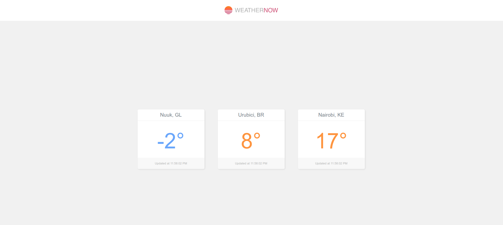
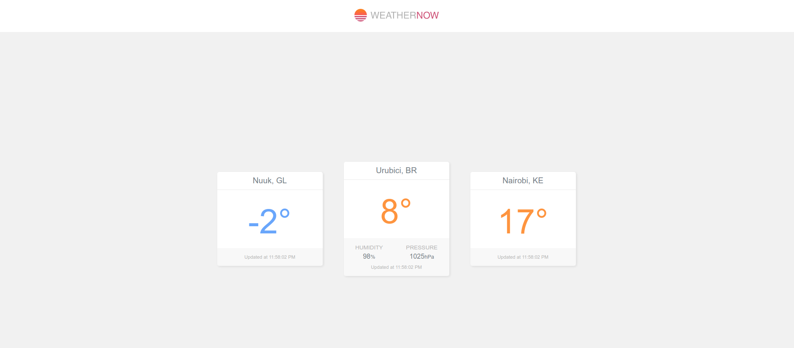
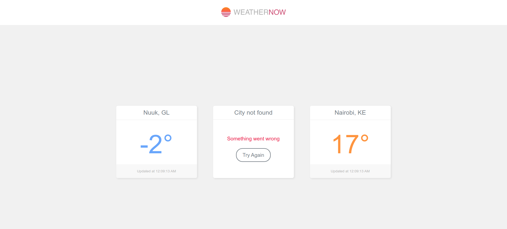
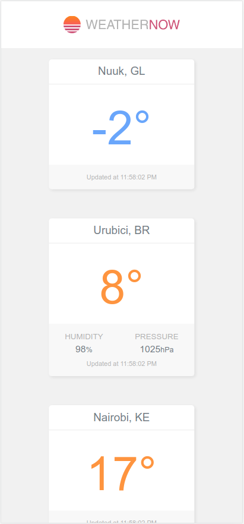
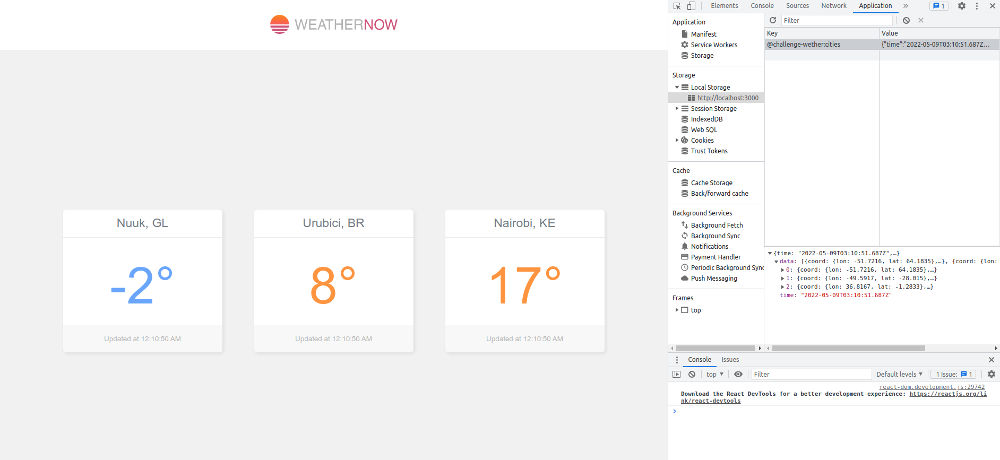
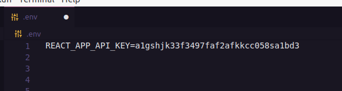

# Teste técnico Conta Azul
Este teste foi realizado avaliar os conhecimentos e habilidades em frontend (HTML, CSS, JavaScript e React).

## Objetivo do teste
O desafio é desenvolver um WebApp criando layout de acordo com layout fornecido, consumir dados por API externa retornando dados de temperatura, umidade e pressão das cidades Nuuk, Urubici e Nairobi.

## Requsitos do teste

- Exibir as condições climáticas das seguintes cidades: Nuuk/GL, Urubici/BR e Nairobi/KE
- Temperatura deve ser exibidas em graus Celsius 
- Umidade deve ser exibida em percentual 
- Pressão deve ser exibida em hectoPascal 
- Temperaturas igual ou abaixo de 5 graus devem ser exibidas em azul. Temperaturas acima de 5 graus e igual ou abaixo de 25 devem ser exibidas em laranja. Temperaturas acima de 25 graus devem ser exibidas em vermelho
- As condições climáticas devem ser atualizadas a cada 10 minutos
- As condições climáticas devem ser cacheadas no front-end por 10 minutos
- Sugestão do o uso da seguinte API: https://openweathermap.org

## Tecnologias utilizadas
O frontend do teste foi desenvolvido utilizando o framework React.JS. Além disso também foram utilizados bibliotecas como:
```
* Axios
* SASS
```
O projeto também possui:
```
* Responsividade adaptada para os dois layouts propostos (Desktop e Mobile)
* Consumo da API externa pelo frontend
* Armazenamento dos dados temporariamente (10 minutos) em Local Storage
```
O app foi desenvolvido para ser o mais fiel aos layouts oferecidos e utilizando os dados da API sugerida

Prévia do Layout desenvolvido:







## Desafios encontrados no teste
* Assincronicidade de requisições
* Assincronicidade do armazenamento do local storage

## Como iniciar o desenvolvimento

Rodar frontend:
```
* Instale o [npm](https://nodejs.org/en/download/)
* Faça o clone do projeto
* Instale as dependências com npm install
* Use npm start/yarn start na pasta para iniciar o projeto.
* Acesse http://localhost:3000
* Crie um arquivo na raiz do projeto nomeado .env conforme exemplo presente no repositório (Nome do arquivo de exemplo: .env.example). Adicione a chave fornecida no e-mail de envio do repositório conforme imagem abaixo:
```

```
* Caso não queira utilizar a key fornecidade por e-mail, pode ser criada uma conta no site https://openweathermap.org
    - Abra seu profile do usuário e clique em "My API Keys"
    - Utilize a key Default ou crie uma nova
    - Substitua a key no arquivo .env conforme citado anteriormente
```